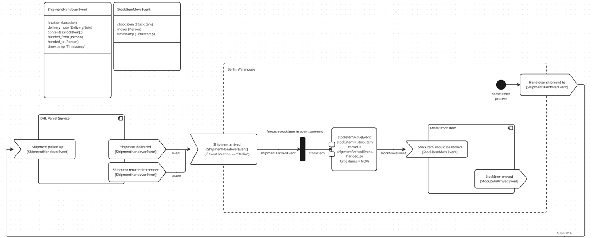

# Product Specification — Processor Playground

> **Purpose of this file.** This document captures the product vision, every
> feature request, every description of how the software is supposed to work,
> and every use-case the owner has expressed. It is the single place that
> agents (and humans) should read first to understand *what* this software is
> for and *what* it is supposed to do.
>
> **Companion docs.**
> - [`ARCHITECTURE.md`](ARCHITECTURE.md) — *how* the code is organised.
> - [`README.md`](README.md) — how to run it.
>
> **How to maintain this file.**
> - Every new feature request, clarification, or product decision from the
>   owner is recorded here, in the relevant section, with a brief reference to
>   the PR / issue / comment it came from.
> - When a request is implemented, do **not** delete it — mark it ✅ and keep
>   the description. This file is the long-term memory of *intent*, not a
>   to-do list.
> - When a later request contradicts an earlier one, leave both, mark the
>   superseded one, and explain the change.

---

## 1. Product vision

A browser-based, WYSIWYG platform for modelling **executable processes**
together with the **data that flows through them**, so that the platform can
*tell the user where data is incompatible, missing, or arriving at the wrong
time* — and the user can then change the process to fix it.

It is both:

- a **process modeller** — flow charts of business processes built from
  nested, reusable modules, and
- a **data-flow modeller** — every signal carries a typed payload, every
  module declares typed inputs and outputs, and the platform reasons about
  type compatibility along the wires.

The platform additionally lets the user *simulate* a model (run it with mock
inputs, see what is emitted, write Python test scripts against it).

---

## 2. Core concepts

### 2.1 Modules

- A **module** represents a process. It has:
  - typed **input signals** and typed **output signals** (its interface),
  - an **implementation**, which is either a **flow chart** or a
    **Python script**.
- Modules can **contain sub-modules**. Composition is recursive.
- **No circular dependencies** are allowed: if A uses B and B uses C, then C
  may not use A.
- When a sub-module appears on the parent's canvas, only its **inputs and
  outputs are shown** — the implementation is hidden. The user can
  **open / drill into** a sub-module to see and edit its implementation.

### 2.2 Signals

- Every signal has a **data type**.
- Signals connect nodes/modules via wires.
- **Incoming signals can carry a filter** so they only trigger when the
  filter condition is met (e.g. `event.location == "Berlin"`).
- **Type compatibility is enforced.** Two signals with different data types
  may only be connected through an explicit **translation node** (a
  data-mapping node) that converts one type into the other.

### 2.3 Data types

Data types are a **first-class, global** concept — they are shared across
all modules, not owned by any one module.

- **Primitive types**: `int`, `decimal`, `string`, `bool`, `timestamp`,
  `any`.
- **Struct types**: named, hierarchical records made of fields, where each
  field has its own data type. Fields may themselves reference struct types,
  so types are arbitrarily nested.
- **Container types**: arrays and dictionaries, with an **explicit element
  type** (e.g. `StockItem[]`, `dict<string, Person>`).
- Data types are used **everywhere data is worked with** — signal payloads,
  variables, file I/O, database I/O, API responses, etc. There is one type
  system, used uniformly.

### 2.4 The canvas (WYSIWYG)

The reference look-and-feel is captured in the screenshot shared by the
owner in PR #1 (see "Berlin Warehouse" example below). Key visual rules:

- The **module currently being edited** is shown as a labelled dashed frame
  on the canvas (the example: `Berlin Warehouse`).
- **Sub-modules** appear as dashed boxes inside the frame, each showing
  their inputs (left) and outputs (right). In the example: `DHL Parcel
  Service` and `Move Stock Item`.
- **Event triggers** are chevron shapes labelled with the event name, the
  signal type in `[brackets]`, and any filter expression in parentheses,
  e.g. `Shipment arrived [ShipmentHandoverEvent] (if event.location == "Berlin")`.
- **For-each** nodes are vertical bars with an iterator expression
  (`foreach stockItem in event.contents`).
- **Edges/wires are labelled** with the signal name flowing along them
  (`shipmentArrivedEvent`, `stockItem`, `stockMoveEvent`, …).
- **Data-mapping nodes** show their mapping expressions inline, e.g.

  ```
  StockItemMoveEvent:
    stock_item = stockItem
    mover      = shipmentArrivedEvent.handed_to
    timestamp  = NOW
  ```
- **Global data types** are documented as small struct cards (above the
  canvas in the screenshot), each listing their fields with types — e.g.
  `ShipmentHandoverEvent { location (Location); delivery_note
  (DeliveryNote); contents (StockItem[]); handed_from (Person); handed_to
  (Person); timestamp (Timestamp) }`.

### 2.5 Node palette (8 node kinds)

| Symbol | Kind          | Purpose                                                  |
| ------ | ------------- | -------------------------------------------------------- |
|  ●     | Start         | Entry point of a flow.                                   |
|  ▷     | Event Trigger | Reacts to an incoming signal; may carry a filter.        |
|  □     | Condition     | Branching / decision on a boolean expression.            |
|  ‖     | For Each      | Iterate over a collection (`foreach x in expr`).         |
|  ⊞     | Sub-module    | Embed another module; double-click to drill in.          |
|  ▶     | Emit Event    | Emit an outgoing signal carrying a typed payload.        |
|  ⇄     | Data Mapping  | Translate one data type into another (typed connector). |
|  ◉     | End           | Termination of a flow.                                   |

### 2.6 Simulation

- The user can **run a module** with mock input data and see what happens
  (variables, datastore reads/writes, file I/O, emitted events, dialogs,
  API call stubs, sub-module results).
- Sub-module calls can be **mocked by interface name**, so a single module
  can be tested in isolation.
- A flow step can be implemented as Python (executed by a sandboxed safe
  interpreter — no imports, no attribute access, no `for`/`while`/`def`).

### 2.7 Test scripts

The user can write Python test scripts (`/api/tests/run`) that:

- load modules (`load_module(...)`),
- run modules in isolation or composition (`run_module(...)`),
- mock interface dependencies (`mocks={"database": …}`),
- assert against the resulting state (`assert_equal(...)`).

---

## 3. Worked example — "Berlin Warehouse"

The canonical reference example (shared by the owner as a screenshot in
PR #1, comment immediately preceding commit `d5b6c79`):



> *Reference diagram for the "Berlin Warehouse" example. Source: PR #1
> comment by @ThomasHilbertAtCervis.
> Original attachment: <https://github.com/user-attachments/assets/dfbaa517-485a-41b1-acba-57d32acefbec>.*

- **Module being edited:** `Berlin Warehouse`.
- **Global types in scope:** `ShipmentHandoverEvent`, `StockItemMoveEvent`
  (and the supporting types they reference: `Location`, `DeliveryNote`,
  `StockItem`, `Person`, `Timestamp`).
- **Sub-modules used:** `DHL Parcel Service`, `Move Stock Item`.
- **Flow:**
  1. *Outside* the warehouse frame, `DHL Parcel Service` emits two events —
     `Shipment delivered [ShipmentHandoverEvent]` and `Shipment returned to
     sender [ShipmentHandoverEvent]` — into the warehouse via the wire
     `event`.
  2. The warehouse's first node is `Shipment arrived
     [ShipmentHandoverEvent]` with the filter
     `event.location == "Berlin"`. Only Berlin shipments proceed.
  3. A **for-each** iterates `stockItem in event.contents`.
  4. A **data-mapping node** builds a `StockItemMoveEvent` from the
     iterated `stockItem` and fields read from the triggering
     `shipmentArrivedEvent`.
  5. The mapped event is sent to the `Move Stock Item` sub-module; the
     sub-module returns a `StockItemMovedEvent`.
  6. Finally, "some other process" hands the shipment to a downstream
     consumer via `Hand over shipment to [ShipmentHandoverEvent]`.

Every later product decision should be checked against this example: can
this be modelled clearly? does the platform help me catch missing data or a
type mismatch?

---

## 4. Feature requests log

Each entry references the source comment, summarises the request, and
tracks status. Status uses ✅ done, 🚧 in progress, 📋 backlog,
🛑 superseded.

### From PR #1 (the inception PR for the playground)

| ID    | Source                                | Request                                                                                                   | Status |
| ----- | ------------------------------------- | --------------------------------------------------------------------------------------------------------- | ------ |
| F-001 | PR #1 initial scope                   | Browser-based playground for modular process simulation (modules, signals, simulation, Python tests).      | ✅     |
| F-002 | PR #1 comment — "Add a Dockerfile…"   | Provide a `Dockerfile` and document how to launch the app via Docker.                                      | ✅ (commit `3f83c66`) |
| F-003 | PR #1 comment with attached screenshot| WYSIWYG editor matching the "Berlin Warehouse" reference look (see §2.4 and §3).                          | ✅ (commit `d5b6c79`) |
| F-004 | Same comment                          | Modules have typed input/output signals; signals carry data types.                                         | ✅     |
| F-005 | Same comment                          | Incompatible signals can only be connected through **translation nodes** (data-mapping nodes).             | 🚧 — Data-mapping node exists; type-compatibility *enforcement* still to be added. |
| F-006 | Same comment                          | Platform must help the user spot **incompatible or missing data**.                                         | 📋     |
| F-007 | Same comment                          | Sub-modules show only inputs/outputs on the parent canvas; can be **opened** to edit implementation.       | ✅ — Submodule node renders signals; double-click opens. |
| F-008 | Same comment                          | A module's implementation may be either a **flow chart** or a **Python script**.                           | 🚧 — Flow chart ✅; Python-script-as-implementation ✅ via the `python` step; needs first-class "this whole module is a script" mode. |
| F-009 | Same comment                          | **No circular dependencies** between modules.                                                              | 📋 — Validation not yet enforced. |
| F-010 | Same comment                          | **Filters on incoming signals** — they only trigger when the condition is met.                             | ✅ — `filter` field on event/condition nodes. |
| F-011 | Same comment                          | Data types are **global** and hierarchical: primitives + structs of named fields + arrays/dicts with explicit element type. | ✅ |
| F-012 | Same comment                          | Use existing flow-chart libraries if they give a good UX and allow heavy customisation; otherwise build. | ✅ — React Flow chosen. |
| F-013 | PR #1 owner clarification             | Data types should be **global** (sidebar), not a per-module overlay.                                       | ✅ (commit `d5b6c79`) |
| F-014 | Repo state                            | Define clear architectural rules, separate concerns, no business logic in views, document the rules.       | ✅ — see `ARCHITECTURE.md`. |
| F-015 | Repo state                            | Add unit tests for all main components so behaviour doesn't deteriorate during ongoing development.        | ✅ — 108 tests across 7 files. |
| F-016 | PR #1 comment 4526108586              | **Track all feature requests and product descriptions in a file** so agents can always refer back to it.   | ✅ — this file. |
| F-017 | PR #1 comment 4528722855              | **Mirror every reference image the owner shares into the repo** and embed/link them from `PRODUCT.md`, so meaning is conveyed by the artwork instead of by description alone. | 🚧 — convention in place (`docs/images/`, §6); Berlin Warehouse image referenced. Local binary still to be committed (sandbox egress blocks the S3-backed user-attachment URL). |
| F-018 | PR #1 comment 4528891051              | **All relevant business logic must execute in the backend.** The frontend is one of many clients (an MCP server is planned so other agents can drive the platform). The UI must never own domain catalogs, normalisation rules, or default-template shapes. | ✅ — moved node-kinds catalog, primitive types, new-module template, and DataType normalisation to the backend behind `/api/node-kinds`, `/api/data-types/primitives`, `POST /api/modules`. ARCHITECTURE.md §1 Goal 6 codifies the rule. |

### Cross-cutting / always-on requirements

| ID    | Requirement                                                                                                         |
| ----- | ------------------------------------------------------------------------------------------------------------------- |
| X-001 | Adhere to established best practices and the layering rules in `ARCHITECTURE.md`.                                   |
| X-002 | Aggressively fix architectural violations as they are noticed.                                                      |
| X-003 | Keep this document up to date — every new owner request goes in §4 with status, every clarification goes in §2/§3.  |

---

## 5. Open questions / things to clarify before building

These are not yet answered by the owner — leave them open and ask before
making large decisions.

- **Type-compatibility enforcement (F-005, F-006):** should the editor
  *prevent* an incompatible connection, *warn* about it, or *auto-insert*
  a translation node placeholder?
- **Script-as-implementation (F-008):** should a module choose its mode
  (flow vs script) up front, or can a flow optionally collapse to a single
  script step?
- **Circular-dependency detection (F-009):** detected at save time (block
  save), at design time (live warning), or at simulation time?
- **Persistence / multi-user:** today everything is JSON files under
  `storage/`. Is a database backend in scope later?

When in doubt, ask the owner on the PR rather than guessing.

---

## 6. Reference images

Every image the owner shares (PR comments, issues, discussions) is mirrored
into [`docs/images/`](docs/images/) so the description above is backed up by
the artwork the owner actually drew. See
[`docs/images/README.md`](docs/images/README.md) for the convention and how
to add new ones.

| File                                                             | Source                                                                                                          | Used in       | Shows                                                              |
| ---------------------------------------------------------------- | --------------------------------------------------------------------------------------------------------------- | ------------- | ------------------------------------------------------------------ |
| [`docs/images/berlin-warehouse-reference.png`](docs/images/berlin-warehouse-reference.png) | PR #1 comment by @ThomasHilbertAtCervis ([attachment](https://github.com/user-attachments/assets/dfbaa517-485a-41b1-acba-57d32acefbec)) | §3 (this doc) | The "Berlin Warehouse" canonical WYSIWYG layout — module frame, sub-modules with input/output signals, typed signal wires, filtered event trigger, for-each, data-mapping node, global data-type cards. |
